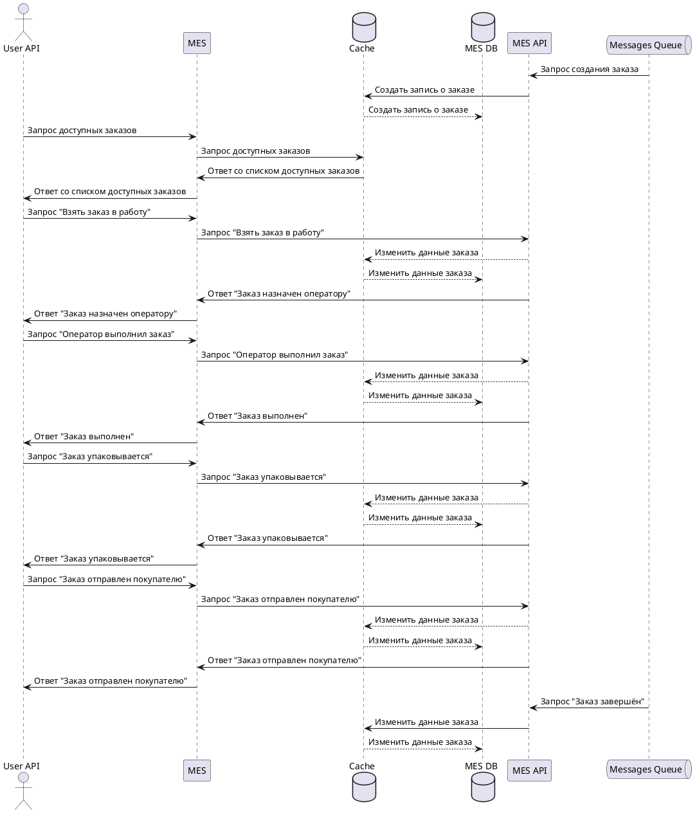

```plantuml
@startuml

actor "User API" as User_API
participant MES as MES
database "Cache" as Cache
database "MES DB" as MES_DB
participant "MES API" as MES_API

queue "Messages Queue" as MessQueue

MessQueue -> MES_API: Запрос создания заказа
MES_API -> Cache: Создать запись о заказе
Cache --> MES_DB: Создать запись о заказе

User_API -> MES: Запрос доступных заказов
MES -> Cache: Запрос доступных заказов
MES <- Cache: Ответ со списком доступных заказов
User_API <- MES: Ответ со списком доступных заказов

User_API -> MES: Запрос "Взять заказ в работу"
MES -> MES_API: Запрос "Взять заказ в работу"
MES_API --> Cache: Изменить данные заказа
Cache --> MES_DB: Изменить данные заказа
MES <- MES_API: Ответ "Заказ назначен оператору" 
User_API <- MES: Ответ "Заказ назначен оператору"

User_API -> MES: Запрос "Оператор выполнил заказ"
MES -> MES_API: Запрос "Оператор выполнил заказ"
MES_API --> Cache: Изменить данные заказа
Cache --> MES_DB: Изменить данные заказа
MES <- MES_API: Ответ "Заказ выполнен" 
User_API <- MES: Ответ "Заказ выполнен"

User_API -> MES: Запрос "Заказ упаковывается"
MES -> MES_API: Запрос "Заказ упаковывается"
MES_API --> Cache: Изменить данные заказа
Cache --> MES_DB: Изменить данные заказа
MES <- MES_API: Ответ "Заказ упаковывается" 
User_API <- MES: Ответ "Заказ упаковывается"

User_API -> MES: Запрос "Заказ отправлен покупателю"
MES -> MES_API: Запрос "Заказ отправлен покупателю"
MES_API --> Cache: Изменить данные заказа
Cache --> MES_DB: Изменить данные заказа
MES <- MES_API: Ответ "Заказ отправлен покупателю" 
User_API <- MES: Ответ "Заказ отправлен покупателю"

MessQueue -> MES_API: Запрос "Заказ завершён"
MES_API -> Cache: Изменить данные заказа
Cache --> MES_DB: Изменить данные заказа

@enduml
```